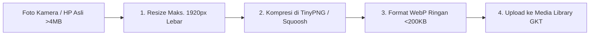

# 🖼️ Modul 4: Standarisasi Media & Kompresi Foto Proyek GKT

Website konstruksi dan interior sangat bergantung pada kualitas visual dokumentasi proyek (*Architectural & Interior Photography*). Namun, file foto kamera berukuran besar (3–10 MB) akan membuat website lambat diakses dan membebani server hosting.

---

## 4.1 Standar Dimensi & Batas Ukuran File GKT

| Penempatan Media | Rasio Aspek | Resolusi Ideal | Format File | Batas Maks. Ukuran |
|---|---|---|---|---|
| **Hero Banner Background** | `16:9` / Panorama | `1920 x 1080 px` | `.webp` / `.jpg` | Maks. **300 KB** |
| **Foto Portofolio Proyek** | `16:9` / `4:3` | `1200 x 800 px` | `.webp` / `.jpg` | Maks. **200 KB** |
| **Ikon Capabilities / Logo** | `1:1` / Transparan | `500 x 500 px` | `.png` / `.svg` | Maks. **80 KB** |
| **Instagram Feed Aset** | `1:1` (Persegi) | `1080 x 1080 px` | `.webp` / `.jpg` | Maks. **150 KB** |

---

## 4.2 Alur Wajib Kompresi Foto Sebelum Upload

1. Buka situs kompresi gratis: [**TinyPNG.com**](https://tinypng.com/) atau [**Squoosh.app**](https://squoosh.app/).
2. Masukkan seluruh foto dokumentasi proyek yang ingin diunggah.
3. Unduh hasil kompresi (ukuran file biasanya turun drastis hingga 75% dengan ketajaman gambar tetap terjaga).

---

## 4.3 Standar Penamaan File (*SEO Image Naming*)

Foto proyek yang diunggah harus memiliki nama deskriptif berbahasa baku untuk membantu SEO Google Gambar:

- ✅ `coffee-shop-fit-out-bojong-nangka-bogor.webp`
- ✅ `renovasi-rumah-klasik-rawalumbu-bekasi.jpg`
- ✅ `interior-studio-apartment-sentraland-karawang.webp`
- ❌ `IMG_9021.JPG`
- ❌ `WhatsApp Image 2026-09-01 at 09.20.15.jpeg`
