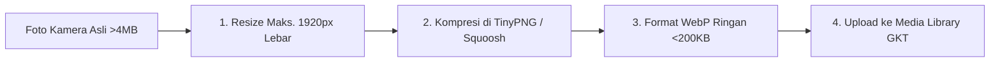

# Modul 4: Standarisasi Media & Kompresi Foto Proyek GKT

Dokumentasi arsitektur dan interior membutuhkan ketajaman visual tinggi. Namun, file foto mentah berukuran besar (3-10 MB) akan memperlambat loading website. Modul ini mengatur standar kompresi dan resolusi file.

---

## 4.1 Standar Dimensi & Batas Ukuran File GKT

| Penempatan Media | Rasio Aspek | Resolusi Ideal | Format File | Batas Maks. Ukuran |
|---|---|---|---|---|
| **Hero Banner Background** | 16:9 / Panorama | `1920 x 1080 px` | `.webp` / `.jpg` | Maks. **300 KB** |
| **Foto Portofolio Proyek** | 16:9 / 4:3 | `1200 x 800 px` | `.webp` / `.jpg` | Maks. **200 KB** |
| **Ikon Capabilities / Logo** | 1:1 / Transparan | `500 x 500 px` | `.png` / `.svg` | Maks. **80 KB** |
| **Instagram Feed Aset** | 1:1 (Persegi) | `1080 x 1080 px` | `.webp` / `.jpg` | Maks. **150 KB** |

---

## 4.2 Alur Kompresi Foto Sebelum Upload

1. Buka situs kompresi: [**TinyPNG.com**](https://tinypng.com/) atau [**Squoosh.app**](https://squoosh.app/).
2. Masukkan foto dokumentasi proyek yang ingin diunggah.
3. Unduh hasil kompresi (ukuran file turun rata-rata 70-80% tanpa mengurangi ketajaman gambar).

---

## 4.3 Standar Penamaan File (SEO Image Naming)

Foto proyek yang diunggah harus menggunakan nama deskriptif berbahasa baku untuk optimasi pencarian:

- Benar: `coffee-shop-fit-out-bojong-nangka-bogor.webp`
- Benar: `renovasi-rumah-klasik-rawalumbu-bekasi.jpg`
- Benar: `interior-studio-apartment-sentraland-karawang.webp`
- Salah: `IMG_9021.JPG`
- Salah: `WhatsApp Image 2026-09-01 at 09.20.15.jpeg`
